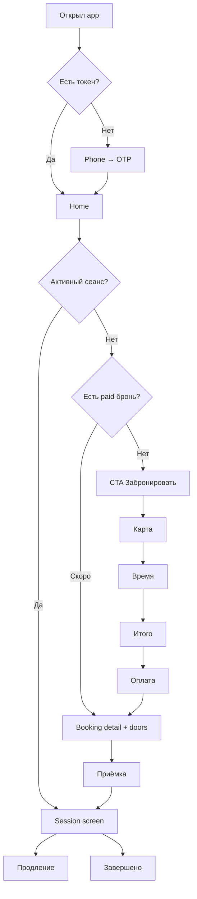

# stopkek Mobile — план экранов, логики и дизайна

**Стек:** Expo (SDK 52+) · Expo Router · TypeScript · Redux Toolkit · React Query (опц.)  
**Цель документа:** чтобы по нему можно было сразу генерировать/писать код без додумывания UX.

**Референсы:**
- Карта зала: [floor-plan-reference.png](../assets/references/floor-plan-reference.png) (tss game)
- Бренд: [logo-stopkek-reference.png](../assets/references/logo-stopkek-reference.png)
- Конкуренты (добавлять): [competitor-apps/mobile/](../assets/references/competitor-apps/mobile/)

> Папка `mobile/` пока пустая — после загрузки скринов обновить §12 «Отличия от референса».

---

## 1. Принципы UX (без лишнего)

| Да | Нет |
|----|-----|
| Один главный CTA на экране | Дублирующие меню |
| Tab bar: 3 вкладки | 5+ вкладок |
| Бронь за 4–5 тапов | Длинные формы |
| Активный сеанс всегда на виду | Поиск функций в профиле |
| Тёмный UI, красный акцент | Градиенты, glassmorphism, анимации ради анимаций |

**Модель навигации:** один клуб (MVP) → не выбираем город/филиал, сразу stopkek.

---

## 2. Дизайн-система (из лого)

### 2.1 Палитра

```ts
// theme/colors.ts
export const colors = {
  bg: '#0A0A0A',           // основной фон
  bgElevated: '#141414',    // карточки, sheet
  bgMuted: '#1E1E1E',       // инпуты, disabled кнопки
  border: '#2A2A2A',

  text: '#FFFFFF',
  textSecondary: '#9E9E9E',
  textDisabled: '#5C5C5C',

  accent: '#C41E24',        // STOP-красный (primary CTA)
  accentHover: '#E53935',
  accentMuted: '#8B1519',   // pressed / outline

  success: '#2E7D32',       // место свободно
  warning: '#F9A825',       // скоро конец сеанса
  danger: '#C62828',        // занято / ошибка
  info: '#42A5F5',

  seatFree: '#2E7D32',
  seatOccupied: '#C62828',
  seatReserved: '#F9A825',   // забронировано, сеанс не начался
  seatRepair: '#424242',
  seatSelected: '#FFFFFF',   // выбрано пользователем (как tss #17)
};
```

### 2.2 Типографика

| Роль | Шрифт | Размер |
|------|-------|--------|
| Бренд / splash | **Permanent Marker** или кастом «KEK» (только лого, заголовки маркетинга) | 32–40 |
| Заголовки экранов | **Manrope** Bold | 22–28 |
| Body | Manrope Regular | 15–16 |
| Caption / подписи зон | Manrope Medium | 12–13 |
| Цифры таймера | Manrope Bold / tabular | 48–56 |

Expo: `@expo-google-fonts/manrope`, `@expo-google-fonts/permanent-marker` (только бренд-блоки).

### 2.3 Компоненты (переиспользуемые)

| Компонент | Описание |
|-----------|----------|
| `StopButton` | Primary: красный fill, белый текст, height 52, radius 12 |
| `GhostButton` | Outline accent |
| `SeatChip` | Квадрат места на карте, состояния из colors |
| `ZoneLabel` | Плашка зоны + specs (GPU, Hz) |
| `BookingCard` | Место + время + статус |
| `TimerRing` | Круговой или цифровой countdown |
| `BalancePill` | Баланс в header |
| `DoorActionRow` | Две кнопки: главная дверь / ячейка |
| `ChecklistItem` | Чекбокс периферии |
| `BottomSheet` | Выбор времени, детали места |

### 2.4 Визуальный характер (Rust / постапокалипсис — дозированно)

- Фон: почти чёрный, **без** текстур на каждом экране.
- Акцент: красный знак STOP — только CTA, selected tab, таймер «мало времени».
- Лого на splash: восьмиугольник (stop sign) как mask/icon.
- Микро-деталь: тонкая «царапина» 1px на header (опционально, один раз).
- **Не делать:** ржавчину на кнопках, skull overlays, glitch на каждом переходе.

---

## 3. Навигация (Expo Router)

```
app/
├── _layout.tsx                 # root: fonts, theme, auth gate
├── index.tsx                   # redirect → (tabs) или auth
│
├── (auth)/                     # неавторизован
│   ├── _layout.tsx
│   ├── welcome.tsx             # онбординг (1 раз)
│   ├── phone.tsx
│   └── otp.tsx
│
├── (tabs)/                     # основное приложение
│   ├── _layout.tsx             # Tab: Главная | Забронировать | Профиль
│   ├── home.tsx
│   ├── book.tsx                # таб = быстрый вход на карту
│   └── profile.tsx
│
├── booking/                    # стек бронирования
│   ├── _layout.tsx
│   ├── map.tsx                 # карта зала
│   ├── time.tsx                # дата/время/длительность
│   ├── summary.tsx             # расчёт тарифа
│   └── payment.tsx             # оплата
│
├── session/
│   ├── [id].tsx                # активный/прошлый сеанс
│   ├── extend.tsx              # продление
│   └── acceptance.tsx          # чеклист приёмки
│
├── wallet/
│   ├── topup.tsx
│   └── history.tsx
│
├── profile/
│   ├── edit.tsx
│   ├── bookings.tsx            # история
│   ├── booking/[id].tsx
│   └── notifications.tsx
│
├── support/
│   └── feedback.tsx
│
├── club/
│   └── info.tsx                # адрес, режим, правила (i)
│
└── legal/
    ├── privacy.tsx
    └── terms.tsx
```

**Deep links (позже):** `stopkek://session/{id}`, `stopkek://booking/{id}`

---

## 4. Полный список экранов (28 + модалки)

### 4.1 Auth flow (первый запуск)

| # | Экран | ID файла | Функции |
|---|-------|----------|---------|
| A1 | **Splash** | встроен в `_layout` / `app.json` | Лого stopkek, загрузка токена |
| A2 | **Welcome / Онбординг** | `(auth)/welcome.tsx` | 2–3 слайда: бронь / оплата / двери. Кнопка «Начать». Показ 1 раз (`AsyncStorage`) |
| A3 | **Телефон** | `(auth)/phone.tsx` | Input +7, маска, «Получить код». Ссылки на privacy/terms |
| A4 | **OTP** | `(auth)/otp.tsx` | 4–6 цифр, таймер повтора 60с, «Изменить номер» |
| A5 | **Имя (опц.)** | можно в `otp` success → modal | Имя для профиля, skip |

### 4.2 Tab: Главная

| # | Экран | Функции |
|---|-------|---------|
| H1 | **Home** | Баланс (tap → topup). Карточка активного сеанса (таймер, место, кнопки «Двери» «Продлить»). Если нет сеанса — CTA «Забронировать». Ближайшая бронь (paid, не started). Баннер «Пополните баланс» если < порога |

### 4.3 Tab: Забронировать → стек booking

| # | Экран | Функции |
|---|-------|---------|
| B1 | **Карта зала** | Референс tss: zoom +/-, center, refresh. Зоны + specs. Тап места → bottom sheet: номер, зона, цена/ч, статус, «Выбрать». Легенда цветов. Header: клуб, адрес, (i). Footer: слот времени, «Выбрали N мест», CTA «Рассчитать тариф» |
| B2 | **Выбор времени** | Дата (календарь/чипы), время начала, длительность (1ч / 2ч / 3ч / custom). Превью: «22:36 – 01:36, 10.05 – 11.05» |
| B3 | **Итого** | Список мест, зона, часы, сумма. Промокод (заглушка disabled в MVP). CTA «Оплатить» |
| B4 | **Оплата** | С баланса / картой (YooKassa WebView или SDK). Успех → экран брони |

### 4.4 Сеанс (после оплаты / во время игры)

| # | Экран | Функции |
|---|-------|---------|
| S1 | **Детали брони** | Статус, QR для PC (позже), таймер до старта / во время. Кнопки дверей. «Я пришёл» → acceptance |
| S2 | **Активный сеанс** | Большой таймер. Место #N. «Открыть главную дверь» / «Открыть ячейку #N». «Продлить». «Проблема с местом» → acceptance или support |
| S3 | **Продление** | +1ч / +2ч / custom, цена, оплата |
| S4 | **Приёмка** | Чеклист: монитор, мышь, наушники, клавиатура. Комментарий. «Всё ок» / «Есть проблема». Блокирует? нет, но напоминание если skip |

### 4.5 Tab: Профиль

| # | Экран | Функции |
|---|-------|---------|
| P1 | **Профиль** | Аватар, имя, телефон. Меню: история броней, транзакции, уведомления, обратная связь, о клубе, выход |
| P2 | **Редактирование** | Имя, email |
| P3 | **История броней** | Список: дата, место, сумма, статус |
| P4 | **Детали прошлой брони** | Read-only |
| P5 | **Уведомления** | Toggle push: сеанс, акции, системные |

### 4.6 Кошелёк

| # | Экран | Функции |
|---|-------|---------|
| W1 | **Пополнение** | Сумма (пресеты 500/1000/2000/custom), YooKassa |
| W2 | **История транзакций** | Пополнения, списания, статусы |

### 4.7 Прочее

| # | Экран | Функции |
|---|-------|---------|
| C1 | **О клубе** | Адрес, карта (Linking), часы, телефон, фото |
| F1 | **Обратная связь** | Рейтинг 1–5, тема, текст, отправить |
| L1 | **Privacy / Terms** | WebView или markdown |

### 4.8 Модалки / bottom sheets (не отдельные routes)

| ID | Когда |
|----|-------|
| `SeatDetailSheet` | Тап по месту на карте |
| `InsufficientBalanceSheet` | Не хватает на оплату → topup |
| `DoorConfirmSheet` | Подтверждение открытия двери |
| `SessionEndingSheet` | За 15 мин (из push/local) |
| `LogoutConfirm` | Выход |

---

## 5. Логика и state machine

### 5.1 Статусы места (с сервера + WS)

```
free → selected (local UI only)
free → reserved (чужая бронь в будущем)
free → occupied (сеанс идёт)
* → maintenance (не кликабельно)
```

### 5.2 Статусы брони

```
draft → pending_payment → paid → active → completed
                      ↘ cancelled
paid → no_show (cron, не пришёл)
active → extended (новый endAt)
```

### 5.3 Главные user flows



### 5.4 Когда доступны двери

| Кнопка | Условие |
|--------|---------|
| Главная дверь | `booking.status ∈ {paid, active}` AND `now ∈ [start - 15min, end]` |
| Ячейка #N | То же + `booking.seatNumber === N` |
| Rate limit | UI: cooldown 10с после успешного открытия |

### 5.5 Redux slices (минимум)

```
auth: { token, user, isLoading }
club: { info, zones, seats, seatsVersion }
bookingDraft: { seatIds, startAt, endAt, calculatedPrice }
wallet: { balance, transactions }
session: { activeBooking, remainingSeconds }
ui: { mapZoom, selectedSeatIds }
```

### 5.6 WebSocket events (client)

```ts
'seat.status'      // { seatId, status }
'booking.updated'  // { bookingId, status, endAt }
'session.tick'     // { bookingId, remainingSeconds } // опционально
```

---

## 6. Карта зала — техническое решение

**MVP:** `react-native-svg` + координаты мест из JSON (не hardcode в компоненте).

```ts
// assets/club-layout.json
{
  "viewBox": "0 0 400 600",
  "zones": [{ "id": "normal", "label": "Normal", "specs": "RTX 4060, 24\" 165hz", "bounds": {...} }],
  "seats": [{ "id": "1", "number": 1, "zoneId": "normal", "x": 40, "y": 120 }]
}
```

- Pan/zoom: `react-native-gesture-handler` + `Reanimated`
- Цвета по `seat.status` из WS
- Выбранные: белая заливка (как tss)
- Контролы: `-` `⊙` `+` `↻` внизу карты

Пока нет плана stopkek — временно копируем раскладку из референса, потом меняем только JSON.

---

## 7. Как заказчик смотрит до Store

| Способ | Когда | Плюсы | Минусы |
|--------|-------|-------|--------|
| **Expo Go** | День 1–7 | QR в терминале, мгновенно | Не все native-модули (YooKassa, push — позже) |
| **EAS Development Build** | Неделя 2+ | Полный native, своя иконка | Нужен Expo account, сборка 10–20 мин |
| **EAS Update (OTA)** | После dev build | Пушишь JS без пересборки | Только JS-слой |
| **Preview APK (Android)** | Демо заказчику | Ссылка на скачивание APK | Только Android |
| **TestFlight (iOS)** | За 2–3 нед до релиза | Как в проде, до 10k тестеров | Apple Developer $99/год, review 1–2 дня |
| **Google Play Internal testing** | Параллельно | Закрытая ссылка | Нужен Play Console $25 once |

### Рекомендуемый pipeline для заказчика

```
Неделя 1–2:  Expo Go (QR на встрече / скриншот в Telegram)
Неделя 3+:   EAS Dev Build + QR (iOS + Android)
Демо:        Запись экрана + Expo Go достаточно
Предрелиз:   TestFlight + Internal Testing
```

**Команды (когда заведём проект):**

```bash
npx create-expo-app@latest stopkek-mobile -t expo-template-blank-typescript
cd stopkek-mobile
npx expo start                    # Expo Go
eas build --profile development   # dev client
eas build --profile preview       # APK для Android
eas submit                        # в сторы (S-08)
```

**Для заказчика без техники:** TestFlight — приглашение по email; Android — ссылка internal track. Плюс короткие видео-демо в Telegram на каждый спринт.

---

## 8. Структура проекта (для генерации кода)

```
stopkek-mobile/
├── app/                    # Expo Router (см. §3)
├── src/
│   ├── components/
│   │   ├── ui/             # Button, Input, Sheet
│   │   ├── map/            # FloorMap, SeatChip, MapControls
│   │   ├── booking/        # BookingCard, TimePicker
│   │   └── session/        # Timer, DoorActions
│   ├── theme/              # colors, typography, spacing
│   ├── store/              # Redux slices
│   ├── api/                # axios/fetch + endpoints
│   ├── hooks/              # useSession, useSeatsWs
│   ├── types/              # Booking, Seat, User
│   └── utils/              # formatPhone, formatDuration
├── assets/
│   ├── club-layout.json
│   ├── images/logo.png
│   └── fonts/
├── app.json
├── eas.json
└── package.json
```

---

## 9. Порядок реализации (для «нейронки» / спринта)

### Фаза 0 — сегодня (каркас + UI без бэка)
1. `create-expo-app` + Router + theme + шрифты
2. Все экраны **заглушками** (mock data)
3. Навигация полностью кликабельна
4. Карта на mock JSON
5. `expo start` → заказчик смотрит в Expo Go

### Фаза 1 — auth + home (S-02 начало)
6. Phone / OTP (mock → API)
7. Home с mock active session

### Фаза 2 — booking (S-02)
8. Карта + WS mock
9. Time → Summary → Payment mock

### Фаза 3 — деньги (S-03)
10. Wallet topup WebView
11. Real payment flow

### Фаза 4 — сеанс (S-04)
12. Doors API
13. Acceptance
14. Extend

### Фаза 5 — polish (S-07)
15. Push
16. Dev build → TestFlight

---

## 10. Mock data (для UI без бэка)

```ts
export const MOCK_CLUB = {
  name: 'stopkek',
  address: 'ул. Примерная, 1',
  rating: 5.0,
};

export const MOCK_SEATS = Array.from({ length: 25 }, (_, i) => ({
  id: String(i + 1),
  number: i + 1,
  zoneId: i < 5 ? 'normal' : i < 15 ? 'vip' : 'bootcamp',
  status: ['free', 'occupied', 'free'][i % 3],
}));
```

---

## 11. Tab bar

| Tab | Иконка | Экран |
|-----|--------|-------|
| Главная | home | `(tabs)/home` |
| Забронировать | grid/map | `(tabs)/book` → redirect `booking/map` |
| Профиль | user | `(tabs)/profile` |

Active tint: `colors.accent`. Background: `colors.bgElevated`.

---

## 12. Отличия stopkek от tss (референс)

| tss | stopkek |
|-----|---------|
| Серый CTA | Красный `StopButton` |
| Белое выбранное место | Белое место + красная обводка зоны |
| Нейтральный бренд | Splash с восьмиугольником + «stopkek» |
| «Рассчитать тариф» | «К оплате» / «Оплатить» |
| — | Блок дверей на session (нет у tss в рефе) |
| — | Приёмка периферии |

После загрузки скринов в `competitor-apps/mobile/` — дополнить таблицу.

---

## 13. Чеклист перед кодом

- [ ] Утвердить палитру и Manrope
- [ ] JSON схемы зала stopkek (или временно 25 мест из рефа)
- [ ] Тарифы по зонам (для mock summary)
- [ ] Expo account + EAS project
- [ ] Apple/Google dev (для TestFlight — позже)

---

## 14. Связанные документы

- [TECHNICAL_SPEC.md](./TECHNICAL_SPEC.md)
- [SPRINTS.md](./SPRINTS.md) — S-02 Mobile App MVP

---

*Следующий шаг: `npx create-expo-app` + scaffold по §8, все routes из §3 с mock из §10.*
