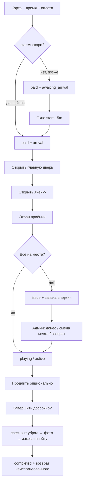

# Сеанс stopkek — бизнес-логика (целевая модель)

Документ описывает **как должно работать** от брони до выхода. Текущий код — упрощённый MVP; ниже — эталон для доработки.

---

## 1. Два сценария брони

| | **Сейчас** | **По расписанию** |
|---|------------|-------------------|
| `startAt` | ближайший слот / «сейчас» (~now) | выбранный слот (например 20:00) |
| Когда платит | сразу перед визитом | может за часы/дни |
| Ожидание | короткое (минуты) | до окна входа |
| Риск | — | не пришёл → `no_show` |

**Общее:** при создании фиксируются `startAt`, `endAt`, `durationMinutes`, цена. Деньги списываются при оплате.

---

## 2. Статусы брони (Booking.status)

```
pending_payment → paid → active → completed
                      ↘ cancelled
                      ↘ no_show (не пришёл к startAt + grace)
```

| Статус | Смысл |
|--------|--------|
| `pending_payment` | Место reserved, 15 мин на оплату |
| `paid` | Оплачено, **игровое время ещё не идёт** (или ждём startAt) |
| `active` | **Идёт оплаченный сеанс** (таймер на экране) |
| `completed` | Сеанс закрыт, место free |
| `cancelled` | Отмена до/админом |
| `no_show` | Не зашёл в клуб к дедлайну (cron) |

**Важно:** сейчас после оплаты сразу `active` — **ошибка**. Нужно: оплата → `paid`, `active` только после успешной приёмки (или автостарт по расписанию — см. §5).

---

## 3. Фазы сессии (sessionPhase) — UX в приложении

Отдельно от `status`, чтобы один экран «Сеанс» менял кнопки:

| Фаза | Когда | Что видит клиент |
|------|--------|------------------|
| `awaiting_arrival` | `paid`, now < startAt − 15 мин | «До начала X», бронь оплачена, двери **закрыты** |
| `arrival` | в окне **[startAt−15м, endAt]** | «Открыть главную дверь» |
| `cell_pending` | дверь открыта / в клубе, ячейка ещё не открыта | «Открыть ячейку #N» (главная — опционально повтор) |
| `acceptance` | ячейка открыта, приёмка не пройдена | **Автопереход** на экран приёмки |
| `issue` | приёмка с проблемой | «Ожидайте админа» + поддержка, таймер **на паузе** |
| `playing` | приёмка OK, `active` | Таймер, «Идёт игра», Продлить |
| `checkout` | нажал «Завершить» | Чеклист: положил периферию → фото → закрыл ячейку |
| `done` | checkout OK | «Спасибо», возврат на главную |

---

## 4. Окна времени

```
        startAt-15m          startAt              endAt
            |------------------|-------------------|
            |   arrival window (двери)           |
            |                  |-- playing ------|
```

- **Главная дверь:** `paid` или `active`, `now ∈ [startAt−15m, endAt]`, фаза ≠ `issue`, ≠ `checkout`.
- **Ячейка #N:** то же + место совпадает с бронью.
- **Rate limit:** не чаще 1 раз / 30 сек на замок (лог в `lock_events`).

---

## 5. Когда тикает игровое время

**Рекомендация (гибрид):**

### A. Бронь «сейчас»
- `startAt` ≈ момент создания (округление до 30 мин).
- После оплаты: `paid`, фаза `arrival`.
- **Таймер игры:** `startedAt` = момент «Всё в порядке» на приёмке; `endAt` = `startedAt + duration` (пересчёт, клиент не теряет оплаченные часы из-за приёмки).
- `status` → `active` при успешной приёмке.

### B. Бронь по расписанию
- `startAt` / `endAt` **фиксированы** при оплате.
- До `startAt−15m`: `awaiting_arrival`.
- В окне: двери + приёмка (можно прийти раньше).
- **Таймер на экране:** до `startAt` — обратный отсчёт «до старта»; с `startAt` — «осталось до endAt».
- `active` с `startAt` (cron/ lazy), **но** без приёмки к `startAt+10m` → `issue` / алерт админу.
- Если не открыл ячейку к `startAt+30m` → `no_show` (место free, возврат по политике).

---

## 6. Цепочка действий (happy path)



---

## 7. Приёмка

**Триггер:** успешная команда «Открыть ячейку» → `sessionPhase = acceptance` → навигация на `/session/acceptance` (нельзя пропустить).

**Чеклист:** монитор, мышь, клавиатура, наушники (+ комментарий).

| Действие | Результат |
|----------|-----------|
| «Всё в порядке» | `POST /bookings/:id/acceptance` ok → `playing`, `startedAt` (для «сейчас» — сдвиг `endAt`) |
| «Есть проблема» | отчёт `hasIssue: true` → `issue`, админка **новая заявка**, push/TG админу |

**Клиент при issue:** таймер пауза, текст «Свяжитесь с поддержкой», кнопка в `/support`. Игра **заблокирована** до решения (админ → `resolve` → `playing` или `cancelled` + refund).

---

## 8. Продление

- Доступно в `playing`, `now < endAt − 5m`.
- Выбор +N часов → расчёт → списание с баланса → `endAt += N`.
- Транзакция `extension`.

---

## 9. Досрочное завершение

**Да, можно** — типично для клубов.

1. Кнопка «Завершить сеанс» в `playing`.
2. Подтверждение: «Оставшееся оплаченное время сгорает без возврата. Продлить — в приложении».
3. `checkout`: инструкция → фото ячейки (обязательно) → «Ячейка закрыта».
4. `endAt` = now, `status` = `completed`, место `free`.

**Возврат при досрочном завершении:** **нет** — оплаченное время не возвращается на баланс.

| Условие | Возврат |
|---------|---------|
| Досрочное завершение пользователем | **0** |
| No-show | **0** |
| Завершение из `issue` / форс-мажор | решение админа (ручная корректировка в админке) |

**Продление:** в любой момент активного сеанса через приложение.

---

## 10. Автозавершение

- `now >= endAt` → `completed`, место `free` (уже есть в `syncSeatStates`).
- Push за 15 и 5 мин до `endAt`.

---

## 11. Админка

| Раздел | Содержимое |
|--------|------------|
| **Заявки приёмки** | место, клиент, что не хватает, коммент, фото, статус open/resolved |
| **Брони** | фаза, кнопки отмена / resolve issue |
| **Двери** | лог открытий (аудит) |

Действия по issue: «Отметить решено», «Отменить сеанс + возврат», «Продлить бесплатно 30м».

---

## 12. Что сейчас в коде vs цель

| Функция | Сейчас | Цель |
|---------|--------|------|
| Оплата → status | сразу `active` | `paid` → после приёмки `active` |
| Двери | Alert mock | API + окна + фазы |
| Приёмка | UI, без API | API + админ-заявки |
| Продление | stub | API + оплата |
| Завершение | только по таймеру | checkout, без возврата остатка |
| Фазы на экране | все кнопки сразу | по `sessionPhase` |
| `no_show` | нет | cron |

---

## 13. Порядок разработки

1. **S-03a:** `paid`/`active`, `sessionPhase`, `getActive` с фазами, экран сеанса по шагам  
2. **S-04:** locks API + приёмка + `acceptance_reports` + админ  
3. **S-03b:** extend + checkout + refund  
4. **S-04b:** no_show cron, push  

См. также `TECHNICAL_SPEC.md` §4.5–4.7, `MOBILE_APP_PLAN.md` §5.4.
